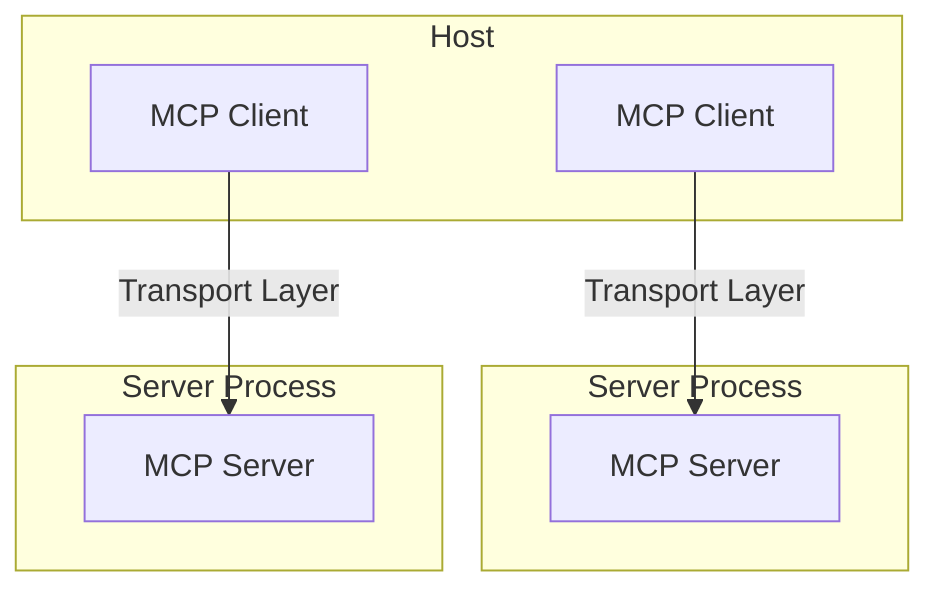

Anthropic's Model Context Protocol (MCP) is a significant development aimed at standardizing how AI models, particularly large language models (LLMs), interact with external data sources and tools. Intuitively, MCP provide a standardized [function calling]() protocol across different LLM providers.

## Architecture

MCP follows a client-server [architecture](https://modelcontextprotocol.io/docs/concepts/architecture) where:
- Hosts are LLM applications (like Claude Desktop or IDEs) that initiate connections
- Clients maintain 1:1 connections with servers, inside the host application
- Servers provide context, tool (function calling in LLMs), and Prompts (Terminology/Prompts) to clients



## Transports
All transports use JSON-RPC 2.0 to exchange messages.

- Message formats
```json
// request
{
  jsonrpc: "2.0",
  id: number | string,
  method: string,
  params?: object
}

// response
{
  jsonrpc: "2.0",
  id: number | string,
  result?: object,
  error?: {
    code: number,
    message: string,
    data?: unknown
  }
}
```
- Transport types:
	- The `STDIO` transport method launches an MCP server as a subprocess and communicates with it through standard input/output streams for local execuation.
	- `SSE` transport enables server-to-client streaming with [HTTP]() POST requests for client-to-server communication.
	- Custom: Any transport implementation just needs to conform to the Transport interface.

## examples

### WindSurf MCP setup
"my github user name is monchewharry, what repo i have on github?"
```json title:"mcp_config.json"
{
  "mcpServers": {
    "github": {
      "command": "npx",
      "args": [
        "-y",
        "@modelcontextprotocol/server-github"
      ],
      "env": {
        "GITHUB_PERSONAL_ACCESS_TOKEN": "github_xxxxxxxxxxx"
      }
    }
  }
}
```

{}
> The WindSurf's LLM (claude 3.5) will determine to use this MCP server named "github", then call the tool 'github / search_repositories' to run a node js program (`npx` command) to find the info on github.

{}

The nodejs program's actual run:
```bash
(base) ➜  ~ json='{"jsonrpc":"2.0", "method":"tools/call","params":{"name":"search_repositories","arguments":{"query":"user:monchewharry"}},"id": 123}'
(base) ➜  ~ GITHUB_PERSONAL_ACCESS_TOKEN=$GITHUB_MCP
(base) ➜  ~ echo $json | npx -y @modelcontextprotocol/server-github
GitHub MCP Server running on stdio

{"result":{"content":[{"type":"text","text":"{\n  \"total_count\": 51,\n  \"incomplete_results\": false,\n  \"items\": [\n    {\n      \"id\": 43044182,\n      \"node_id\": \"MDEwOlJlcG9zaXRvcnk0MzA0NDE4Mg==\",\n      \"name\": \"R_twitter_politics\",\n      \"full_name\": \"monchewharry/R_twitter_politics\",\n      \"private\": false,\n      \"owner\": {\n        \"login\": \"monchewharry\",\n        \"id\": 8972930,\n        \"node_id\": \"MDQ6VXNlcjg5NzI5MzA=\",\n        \"avatar_url\": \"https://avatars.githubusercontent.com/u/8972930?v=4\",\n        \"url\": \"https://api.github.com/users/monchewharry\",\n        \"html_url\": \"https://github.com/monchewharry\",\n        \"type\": \"User\"\n      },\n      \"html_url\": \"https://github.com/monchewharry/R_twitter_politics\",\n      \"description\": null,\n      \"fork\": false,\n      \"url\": \"https://api.github.com/repos/monchewharry/R_twitter_politics\",\n      \"created_at\": \"2015-09-24T04:10:51Z\",\n      \"updated_at\": \"2021-11-02T05:50:07Z\",\n      \"pushed_at\": \"2021-11-02T05:50:04Z\",\n      \"git_url\": \"git://github.com/monchewharry/R_twitter_politics.git\",\n      \"ssh_url\": \"git@github.com:monchewharry/R_twitter_politics.git\",\n      \"clone_url\": \"https://github.com/monchewharry/R_twitter_politics.git\",\n      \"default_branch\": \"master\"\n    },\n    {\n      \"id\": 54813693,\n      \"node_id\": \"MDEwOlJlcG9zaXRvcnk1NDgxMzY5Mw==\",\n      \"name\": \"High_freq_R\",\n      \"full_name\": \"monchewharry/High_freq_R\",\n      \"private\": true,\n      \"owner\": {\n        \"login\": \"monchewharry\",\n        \"id\": 8972930,\n        \"node_id\": \"MDQ6VXNlcjg5NzI5MzA=\",\n        \"avatar_url\": \"https://avatars.githubusercontent.com/u/8972930?v=4\",\n        \"url\": \"https://api.github.com/users/monchewharry\",\n        \"html_url\": \"https://github.com/monchewharry\",\n        \"type\": \"User\"\n      },\n      \"html_url\": \"https://github.com/monchewharry/High_freq_R\",\n      \"description\": null,\n      \"fork\": false,\n      \"url\": \"https://api.github.com/repos/monchewharry/High_freq_R\",\n      \"created_at\": \"2016-03-27T05:11:01Z\",\n      \"updated_at\": \"2022-02-24T12:55:22Z\",\n      \"pushed_at\": \"2016-03-27T07:52:05Z\",\n      \"git_url\": \"git://github.com/monchewharry/High_freq_R.git\",\n      \"ssh_url\": \"git@github.com:monchewharry/High_freq_R.git\",\n      \"clone_url\": \"https://github.com/monchewharry/High_freq_R.git\",\n      \"default_branch\": \"master\"\n    }\n  ]\n}"}]},"jsonrpc":"2.0","id":123}
```

>Similar setup could be done for Curosr and VSCode (through extension Cline).
### Common MCP servers

- https://github.com/modelcontextprotocol/servers
- [smithery.ai](https://smithery.ai/) is a collection of powerful MCP servers.