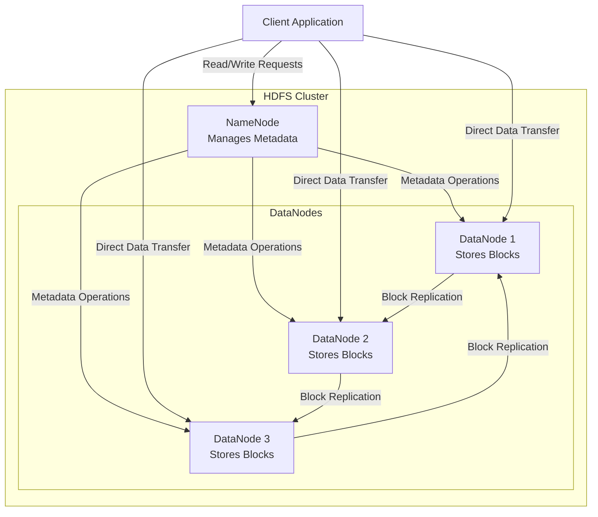

Hadoop Distributed File System (HDFS) is a storage system that breaks large files into smaller blocks and distributes them across a cluster of machines. It’s optimized for high throughput (processing large datasets sequentially) rather than low latency, making it ideal for batch processing tasks like those in Hadoop `MapReduce`. 

HDFS can be regarded as a middle layer between applications and the underlying file systems of multiple servers:
- Applications don’t need to know the details of where or how data is stored across multiple servers. They interact with HDFS as if it were a single, unified file system.
- HDFS handles the complexity of distributing, replicating, and retrieving data across the cluster’s servers.

## framework

HDFS uses a master-slave architecture with two main types of nodes:
1. NameNode (Master):
	- <mark>NameSpace</mark>: Manages the file system’s [[metadata]] (e.g., directory structure, file locations).
	- Keeps track of where each block of a file is stored in the cluster.
	- Runs on one machine and is a single point of control (though it can have a backup for fault tolerance).
	- Stores metadata in [[Memory]] and on disk (e.g., in a `fsimage` file and `editlog`).
2. DataNodes (Slaves):
	- Store the actual <mark>data blocks</mark> (binary chunks of files).
	- Run on multiple machines in the cluster.
	- Handle read/write requests and report block status to the NameNode.

## Data Storage Process
- Block Splitting: A large file (e.g., 1GB) is split into fixed-size blocks (default: 128MB or 64MB).
- Replication: Each block is replicated (default: 3 copies) across different DataNodes for redundancy.
- Distribution: Blocks are spread across the cluster to balance load and enable parallel processing.
- Example: A 300MB file becomes 3 blocks (128MB, 128MB, 44MB), each stored on multiple DataNodes.

## Reading/Writing
- Write: A client sends data to the `NameNode`, which assigns block locations. The data is then written to `DataNodes` in a pipeline (block by block).
- Read: The client asks the `NameNode` for block locations, then fetches them directly from `DataNodes` in parallel.