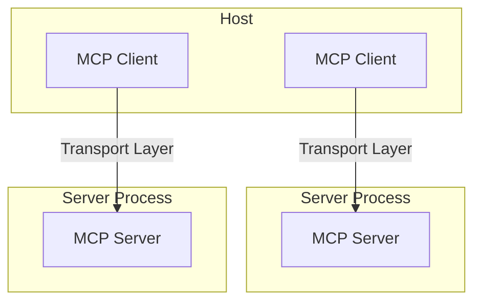

Anthropic's Model Context Protocol (MCP) is a significant development aimed at standardizing how AI models, particularly large language models (LLMs), interact with external data sources and tools. Intuitively, MCP provide a standardized [function calling]() protocol across different LLM providers.

## Architecture

MCP follows a client-server [architecture](https://modelcontextprotocol.io/docs/concepts/architecture) where:
- Hosts are LLM applications (like Claude Desktop or IDEs) that initiate connections
- Clients maintain 1:1 connections with servers, inside the host application
- Servers provide context, tool (function calling in LLMs), and Prompts (Terminology/Prompts) to clients



## Transports
All transports use JSON-RPC 2.0 to exchange messages.

- Message formats
```json
// request
{
  jsonrpc: "2.0",
  id: number | string,
  method: string,
  params?: object
}

// response
{
  jsonrpc: "2.0",
  id: number | string,
  result?: object,
  error?: {
    code: number,
    message: string,
    data?: unknown
  }
}
```
- Transport types:
	- The `STDIO` transport method launches an MCP server as a subprocess and communicates with it through standard input/output streams for local execuation.
	- `SSE` transport enables server-to-client streaming with [HTTP]() POST requests for client-to-server communication.
	- Custom: Any transport implementation just needs to conform to the Transport interface.

## MCP and Prompt

 Use [cloudflare](https://www.cloudflare.com/learning/what-is-cloudflare/) to log the [[HTTP]] messages between VSCode-Cline client and LLM provider DeepSeek V3:
- The sent system prompts provide the information of MCP servers and [tool]()'s configurations.
	 1. `use_mcp_tool` 
	 2. `access_mcp_resource`
	 3. `Available Tools`: each MCP server provides a list of tools
- The first received response will be the LLM's choice of MCP server and tools' configuration.
- The client (vscode-cline) then call the specific tool and wrap the result with context back to the LLM.
- For those LLM models that does not provide function call API but support MCP, MCP can still serve as an acceptable middle layer to use the external resources.
```json title:"request message"
{
    "model": "deepseek/deepseek-chat:free",
    "messages": [
      {
        "role": "system",
        "content": "You are Cline, a highly skilled software engineer with extensive knowledge in many programming languages, frameworks, design patterns, and best practices.\n\n====\n\nTOOL USE\n\nYou have access to a set of tools that are executed upon the user's approval. You can use one tool per message, and will receive the result of that tool use in the user's response. You use tools step-by-step to accomplish a given task, with each tool use informed by the result of the previous tool use.\n\n# Tool Use Formatting\n\nTool use is formatted using XML-style tags. ....... MCP SERVERS\n\nThe Model Context Protocol (MCP) enables communication between the system and locally running MCP servers that provide additional tools and resources to extend your capabilities.\n\n# Connected MCP Servers\n\nWhen a server is connected, you can use the server's tools via the `use_mcp_tool` tool, and access the server's resources via the `access_mcp_resource` tool.\n\n## github.com/modelcontextprotocol/servers/tree/main/src/github (`npx -y @modelcontextprotocol/server-github`)\n\n### Available Tools\n- create_or_update_file: Create or update a single file in a GitHub repository\n    Input Schema:\n    {\n      \"type\": \"object\",\n      \"properties\": {\n        \"owner\": {\n          \"type\": \"string\",\n          \"description\": \"Repository owner (username or organization)\"\n        },\n        \"repo\": {\n          \"type\": \"string\",\n          \"description\": \"Repository name\"\n        },\n        \"path\": {\n          \"type\": \"string\",\n          \"description\": \"Path where to create/update the file\"\n        },\n        \"content\": {\n          \"type\": \"string\",\n          \"description\": \"Content of the file\"\n        },\n"
      },
      {
        "role": "user",
        "content": [
          {
            "type": "text",
            "text": "<task>\nmy github username is monchewharry. list out my repo on github\n</task>"
          },
          {
            "type": "text",
            "text": "<environment_details>\n# VSCode Visible Files\n../Library/Application Support/Code/User/globalStorage/saoudrizwan.claude-dev/settings/cline_mcp_settings.json\n\n# VSCode Open Tabs\n../Library/Application Support/Code/User/globalStorage/saoudrizwan.claude-dev/settings/cline_mcp_settings.json\n\n# Current Time\n3/25/2025, 3:36:07 PM (America/New_York, UTC-4:00)\n\n# Current Working Directory (/Desktop) Files\n(Desktop files not shown automatically. Use list_files to explore if needed.)\n\n# Current Mode\nACT MODE\n</environment_details>"
          }
        ]
      }
    ],
    "temperature": 0,
    "stream": true,
    "stream_options": {
      "include_usage": true
    }
  }
```
The LLM model (DeepSeek) will then return an assistant message as follows to indicate determined MCP server and tools. The application could further construct the MCP request message:
```json title:"response message"
{
    "id": "gen-1742931367-X2M1Lq706SUK7u25SAq8",
    "provider": "Chutes",
    "model": "deepseek/deepseek-chat",
    "choices": [
      {
        "delta": {
          "role": "assistant",
          "content": "<thinking>\nI need to list the GitHub repositories for the user 'monchewharry'. The GitHub MCP server is already connected and provides a 'search_repositories' tool that can be used to search for repositories by owner. I'll use this tool to find repositories owned by 'monchewharry'.\n</thinking>\n\n<use_mcp_tool>\n<server_name>github.com/modelcontextprotocol/servers/tree/main/src/github</server_name>\n<tool_name>search_repositories</tool_name>\n<arguments>\n{\n  \"query\": \"user:monchewharry\",\n  \"page\": 1,\n  \"perPage\": 100\n}\n</arguments>\n</use_mcp_tool>"
        }
      }
    ],
    "usage": {
      "prompt_tokens": 19501,
      "completion_tokens": 149,
      "total_tokens": 19650,
      "cost": 0,
      "prompt_tokens_details": {
        "cached_tokens": 0
      },
      "completion_tokens_details": {
        "reasoning_tokens": 0
      }
    },
    "streamed_data": [...]
  }
```

>Given the above returned assistant message, the application will build the MCP request to MCP server, run the corresponding tools, and construct the secound round messages sent to LLM based on MCP responses. The workflow is similar to the [function calling]().

## Implementation

### WindSurf MCP setup
"my github user name is monchewharry, what repo i have on github?"
```json title:"mcp_config.json"
{
  "mcpServers": {
    "github": {
      "command": "npx",
      "args": [
        "-y",
        "@modelcontextprotocol/server-github"
      ],
      "env": {
        "GITHUB_PERSONAL_ACCESS_TOKEN": "github_xxxxxxxxxxx"
      }
    }
  }
}
```


> The WindSurf's LLM (claude 3.5) will determine to use this MCP server named "github", then call the tool 'github / search_repositories' to run a node js program (`npx` command) to find the info on github.



The nodejs program's actual run:
```bash
(base) ➜  ~ json='{"jsonrpc":"2.0", "method":"tools/call","params":{"name":"search_repositories","arguments":{"query":"user:monchewharry"}},"id": 123}'
(base) ➜  ~ GITHUB_PERSONAL_ACCESS_TOKEN=$GITHUB_MCP
(base) ➜  ~ echo $json | npx -y @modelcontextprotocol/server-github
GitHub MCP Server running on stdio

{"result":{"content":[{"type":"text","text":"{\n  \"total_count\": 51,\n  \"incomplete_results\": false,\n  \"items\": [\n    {\n      \"id\": 43044182,\n      \"node_id\": \"MDEwOlJlcG9zaXRvcnk0MzA0NDE4Mg==\",\n      \"name\": \"R_twitter_politics\",\n      \"full_name\": \"monchewharry/R_twitter_politics\",\n      \"private\": false,\n      \"owner\": {\n        \"login\": \"monchewharry\",\n        \"id\": 8972930,\n        \"node_id\": \"MDQ6VXNlcjg5NzI5MzA=\",\n        \"avatar_url\": \"https://avatars.githubusercontent.com/u/8972930?v=4\",\n        \"url\": \"https://api.github.com/users/monchewharry\",\n        \"html_url\": \"https://github.com/monchewharry\",\n        \"type\": \"User\"\n      },\n      \"html_url\": \"https://github.com/monchewharry/R_twitter_politics\",\n      \"description\": null,\n      \"fork\": false,\n      \"url\": \"https://api.github.com/repos/monchewharry/R_twitter_politics\",\n      \"created_at\": \"2015-09-24T04:10:51Z\",\n      \"updated_at\": \"2021-11-02T05:50:07Z\",\n      \"pushed_at\": \"2021-11-02T05:50:04Z\",\n      \"git_url\": \"git://github.com/monchewharry/R_twitter_politics.git\",\n      \"ssh_url\": \"git@github.com:monchewharry/R_twitter_politics.git\",\n      \"clone_url\": \"https://github.com/monchewharry/R_twitter_politics.git\",\n      \"default_branch\": \"master\"\n    },\n    {\n      \"id\": 54813693,\n      \"node_id\": \"MDEwOlJlcG9zaXRvcnk1NDgxMzY5Mw==\",\n      \"name\": \"High_freq_R\",\n      \"full_name\": \"monchewharry/High_freq_R\",\n      \"private\": true,\n      \"owner\": {\n        \"login\": \"monchewharry\",\n        \"id\": 8972930,\n        \"node_id\": \"MDQ6VXNlcjg5NzI5MzA=\",\n        \"avatar_url\": \"https://avatars.githubusercontent.com/u/8972930?v=4\",\n        \"url\": \"https://api.github.com/users/monchewharry\",\n        \"html_url\": \"https://github.com/monchewharry\",\n        \"type\": \"User\"\n      },\n      \"html_url\": \"https://github.com/monchewharry/High_freq_R\",\n      \"description\": null,\n      \"fork\": false,\n      \"url\": \"https://api.github.com/repos/monchewharry/High_freq_R\",\n      \"created_at\": \"2016-03-27T05:11:01Z\",\n      \"updated_at\": \"2022-02-24T12:55:22Z\",\n      \"pushed_at\": \"2016-03-27T07:52:05Z\",\n      \"git_url\": \"git://github.com/monchewharry/High_freq_R.git\",\n      \"ssh_url\": \"git@github.com:monchewharry/High_freq_R.git\",\n      \"clone_url\": \"https://github.com/monchewharry/High_freq_R.git\",\n      \"default_branch\": \"master\"\n    }\n  ]\n}"}]},"jsonrpc":"2.0","id":123}
```

>Similar setup could be done for Curosr and VSCode (through extension Cline).
### Common MCP servers

- https://github.com/modelcontextprotocol/servers
- [smithery.ai](https://smithery.ai/) is a collection of powerful MCP servers.